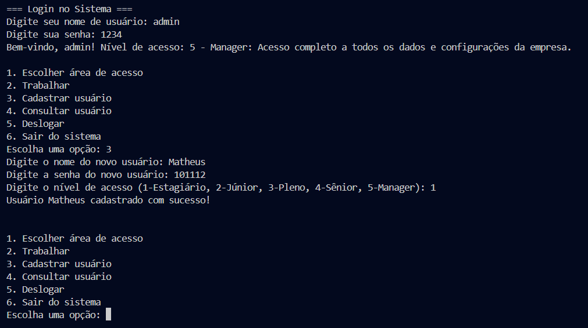

<h1 align="center"> Sistema de Controle de Acesso </h1>

Projeto com foco em Estruturação de Dados, Lógica de Controle e Interação Básica

  

## 🚀 Tecnologias

Esse projeto foi desenvolvido com as seguintes tecnologias:

- Python
- Visual Studio Code

## 💻 Projeto

Este projeto proporciona prática em programação Python, organização de dados e simulação de sistemas reais, sendo uma ótima introdução a sistemas mais avançados.  

Estruturação de Dados: Uso de dicionários e listas para organizar informações como permissões e usuários.

Lógica de Controle: Implementação de fluxos de autenticação, validação e permissões.

Modularidade: Divisão do código em funções reutilizáveis, como cadastro e login.

Controle de Acesso: Simulação de hierarquias e níveis de permissão baseados em cargos.

Interação Básica: Criação de menus textuais dinâmicos e validação de entradas do usuário.

(**) Para utilizar o projeto inicialmente, é necessário logar como usuário "admin" e senha "1234" (**)
